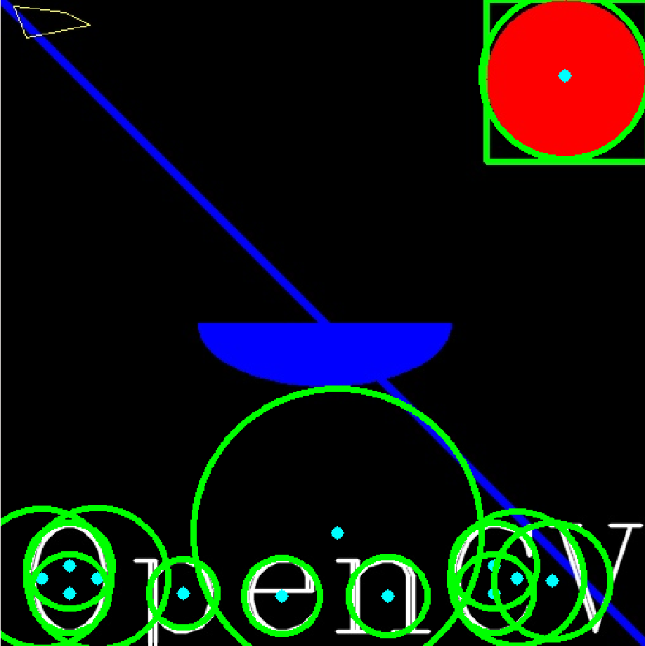
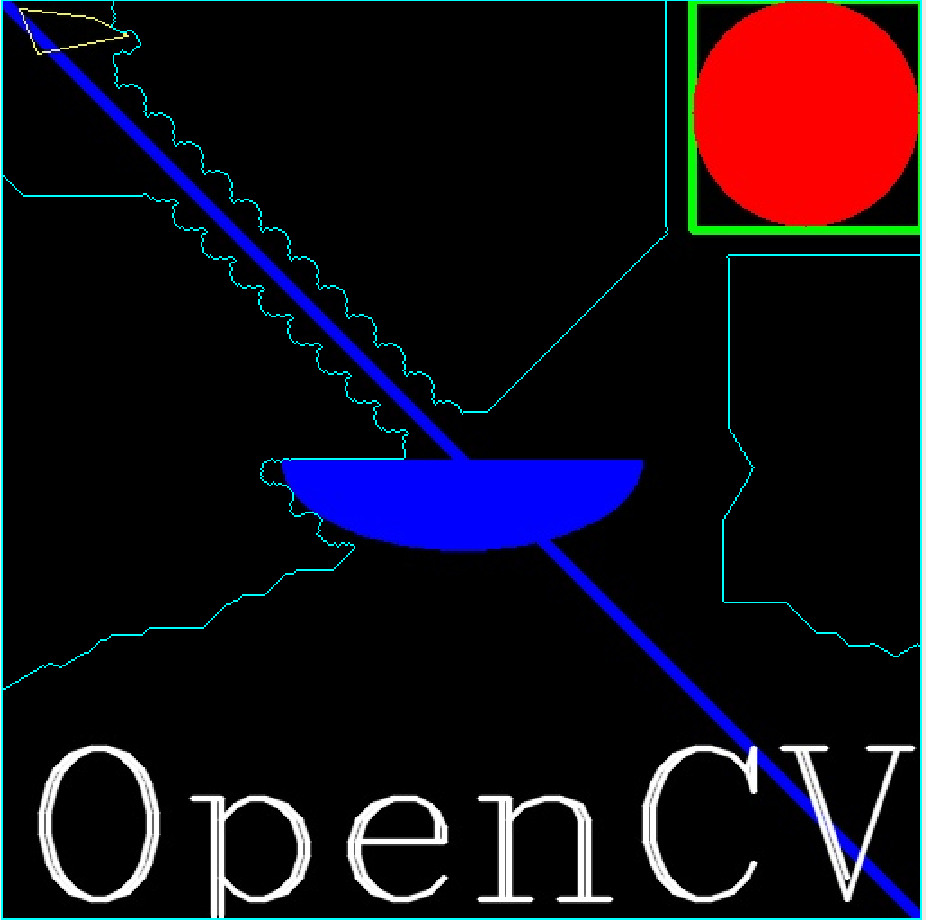

# Learning Computer Vision (OpenCV discription)

## 安装python-opencv

安装阶段最容易犯的错误就是顾名思义，虽然在程序中引入的是cv2这个包，但本身安装的包名称并不是它。

使用`pip install python-opencv`在终端下安装python包。

在pycharm中设置虚拟环境解释器时，不要添加名为cv2的包，而是添加名为`python-opencv`的包，否则会报错。


解决相关错误详情见https://stackoverflow.com/questions/47390692/error-while-installing-cv2-in-pycharm-python-3-5-3

## 图片处理基础

所有的方法是基于OpenCV的Python库cv2，其引入操作为：

```python
import cv2
```

### 加载图片并输出

先看一个最简单的例子：加载一张图片并将其输出。

```python
import cv2
import numpy as np

# load a color image in gray scale
img = cv2.imread('test.JPG',0)

# show the image
cv2.namedWindow('image',cv2.WINDOW_NORMAL)
cv2.imshow('image',img)
cv2.waitKey(0)
cv2.destroyAllWindows()
```

分析代码，首先创建图片对象，调用`cv2.imread`读取图片信息，为方便搜索，这里我将图片保存在项目所在文件夹中，故无需写明相对路径。第二个参数是可选的flag，０代表`cv2.IMREAD_GRAYSCALE`，图片加载为灰度图；-1代表`cv2.IMREAD_UNCHANGED`，图片加载为原图，不更改确定重叠像素点混合比例的alpha信道；１代表`cv2.IMREAD_COLOR`，图片只根据彩色加载，任何透明度都会被忽略。

第四行中调用`cv2.namedWindow()`，首先新建了一个窗口对象，其第二个参数为可选，默认为`cv2.WINDOW_AUTOSIZE` 这样的设置使得图片加载大小完全与出事分辨率一致，可能导致窗口尺寸不合适；这时更适合采用`cv2.WINDOW_NORMAL`，这样创建的窗口对象大小可以自行调整，通常能匹配屏幕分辨率。

接下来调用`cv2.imshow()`，一个参数为图片标题，另一个参数为图片对象名称。

`cv2.waitKey()`方法设置程序运行时间，输入非零值t作为参数，如果程序运行后t时间内没有任何操作，则自动结束运行。若输入０，则程序不会自动结束运行。

最后的代码很简单，在程序结束运行时关闭所有窗口，即销毁所有窗口对象。

### 保存图片

下面，我们使功能更复杂一些：以灰度图方式读取图片，在窗口中以正常比例显示，可以将窗口关闭，也可以按's'键直接保存灰度图片。

```python
import cv2
import numpy as np

# read the image
img = cv2.imread("test.JPG",0)
cv2.namedWindow("test",cv2.WINDOW_NORMAL)
cv2.imshow("test",img)
k = cv2.waitKey(0)
if k==27:　# if press 'esc',quit without saving image
    cv2.destroyAllWindows()
elif k==ord('s'): # if press 's',save image and quit
    cv2.imwrite("testgray.JPG",img)
    cv2.destroyAllWindows()
```

接下来，我们使图片打印界面更美观，这里引入`matplotlib`中的 `pyplot`包。

```python
import numpy as np
from matplotlib import pyplot as plt
import cv2

img = cv2.imread("test.JPG",0)
plt.imshow(img,cmap='gray',interpolation='bicubic')
plt.xticks([])
plt.yticks([])
plt.show()
```

分析代码，核心代码是`plt.imshow`方法的调用。第一个参数是图片对象名，第二个参数是映射方式（这里是灰度），第三个参数是差值方式（这里是双立方插值）。

`plt.{x,y}ticks`使横纵轴坐标值都隐去。

需要注意的是，opencv以BGR信道解析彩色图片，而matplotlib以RBG信道解析彩色图片，因此可能会有差别，看下面的例子。

```python
import cv2
import numpy as np
import matplotlib.pyplot as plt
img = cv2.imread("test.JPG")
b,g,r = cv2.split(img)
img2 = cv2.merge([r,g,b])
plt.subplot(121)
plt.imshow(img) # expects distorted color
plt.subplot(122)
plt.imshow(img2) # expects true color

cv2.namedWindow("BGR",cv2.WINDOW_NORMAL)
cv2.namedWindow("RGB",cv2.WINDOW_NORMAL)
cv2.imshow("BGR",img) # expects true color
cv2.imshow("RGB",img2) # expects distorted color
cv2.waitKey(0)
cv2.destroyAllWindows()
```


可以看到，以bgr信道拆分的原图在重组为rgb信道后颜色出现了扭曲。

## 视频处理基础

### 从摄像机获取视频

```python
import cv2
cap = cv2.VideoCapture(0)
# capture video from device whose index is '0'

while(True):
    ret,frame = cap.read()
    # capture frame-by-frame
    gray = cv2.cvtColor(frame,cv2.COLOR_BGR2GRAY)
    # operations on frame:convert bgr to gray scale
    cv2.imshow('frame',gray)
    # display the resulting frame
    if cv2.waitKey(1) & 0xFF == ord('q'):
        break
cap.release()
# when everything is done, release the capture
cv2.destroyAllWindows()
```

分析代码，`cap.read()`返回一个布尔值，表明视频是否成功加载，因此可以通过返回值判断视频结尾。有时视频对象并没有被初始化，通过`cap.isOpened()`判断，若未初始化，则使用`cap.open()`打开。通过`cap.get()`方法获取视频某些属性，这个值为０－１８，其中比较常用的有３——视频帧宽度，４——视频帧高度，５——视频秒帧数。

循环体中，我们从视频中一帧一帧地读取，数据类型为图片，由彩色转化为灰度图，以及打印帧图都是基于图片完成的，可以说，对视频的操作就是基于图片的。

循环体的结束条件为按下键盘上'q'键，此时停止获取视频。在结束获取后，释放整个视频。

> Property identifier. It can be one of the following:
>
> - **CV_CAP_PROP_POS_MSEC** Current position of the video file in milliseconds or video capture timestamp.
> - **CV_CAP_PROP_POS_FRAMES** 0-based index of the frame to be decoded/captured next.
> - **CV_CAP_PROP_POS_AVI_RATIO** Relative position of the video file: 0 - start of the film, 1 - end of the film.
> - **CV_CAP_PROP_FRAME_WIDTH** Width of the frames in the video stream.
> - **CV_CAP_PROP_FRAME_HEIGHT** Height of the frames in the video stream.
> - **CV_CAP_PROP_FPS** Frame rate.
> - **CV_CAP_PROP_FOURCC** 4-character code of codec.
> - **CV_CAP_PROP_FRAME_COUNT** Number of frames in the video file.
> - **CV_CAP_PROP_FORMAT** Format of the Mat objects returned by `retrieve()` .
> - **CV_CAP_PROP_MODE** Backend-specific value indicating the current capture mode.
> - **CV_CAP_PROP_BRIGHTNESS** Brightness of the image (only for cameras).
> - **CV_CAP_PROP_CONTRAST** Contrast of the image (only for cameras).
> - **CV_CAP_PROP_SATURATION** Saturation of the image (only for cameras).
> - **CV_CAP_PROP_HUE** Hue of the image (only for cameras).
> - **CV_CAP_PROP_GAIN** Gain of the image (only for cameras).
> - **CV_CAP_PROP_EXPOSURE** Exposure (only for cameras).
> - **CV_CAP_PROP_CONVERT_RGB** Boolean flags indicating whether images should be converted to RGB.
> - **CV_CAP_PROP_WHITE_BALANCE_U** The U value of the whitebalance setting (note: only supported by DC1394 v 2.x backend currently)
> - **CV_CAP_PROP_WHITE_BALANCE_V** The V value of the whitebalance setting (note: only supported by DC1394 v 2.x backend currently)
> - **CV_CAP_PROP_RECTIFICATION** Rectification flag for stereo cameras (note: only supported by DC1394 v 2.x backend currently)
> - **CV_CAP_PROP_ISO_SPEED** The ISO speed of the camera (note: only supported by DC1394 v 2.x backend currently)
> - **CV_CAP_PROP_BUFFERSIZE** Amount of frames stored in internal buffer memory (note: only supported by DC1394 v 2.x backend currently)

### 从文件获取视频

从文件获取视频与从摄像机大同小异，只是循环要判断视频是否成功加载，使用`cap.isOpened()`方法。

```python
import cv2
cap = cv2.VideoCapture("test.avi")

while(cap.isOpened()):
    # if cap is opened, execute on
    ret,frame = cap.read()
    gray = cv2.cvtColor(frame,cv2.COLOR_BGR2GRAY)
    cv2.imshow('frame',gray)
    if cv2.waitKey(1) & 0xFF == ord('q'):
        break

cap.release()
cv2.destroyAllWindows()

```

### 保存视频

保存视频的核心代码有如下几个步骤：首先确定保存视频名称；其次确定FourCC编码格式，在我们的linux系统中，一般使用DIVX， 而MJPG生成尺寸较大的视频， X264生成尺寸较小的视频；接下来确定秒帧数和帧尺寸；最后是确定是否为彩色视频，默认为灰度。而`cv2.VideoWritter()`方法调用所需的四个参数正是这四个。

```python
import cv2
cap = cv2.VideoCapture("test.avi")
fourcc = cv2.VideoWriter_fourcc(*'XVID')
out = cv2.VideoWriter(
    "graytest.avi", # set output video name
    fourcc, # set fourcc codec
    20.0, # set fps, namely frame per second
    (640,480)　# set frame size
)
while(cap.isOpened()):
    ret,frame = cap.read()
    if ret==True:
        frame = cv2.flip(frame,0)
        # vertical direction by default
        out.write(frame)
        # write the flipped frame
        cv2.imshow('frame',frame)
        if cv2.waitKey(1) & 0xFF == ord('q'):
            break
    else:
        break
cap.release()
out.release()
cv2.destroyAllWindows()

```

分析代码，循环的必要条件是视频被正确打开，循环体中调用`cv2.filp()`方法获取帧，接下来将帧写入`out`对象，同时打印获取到的每一帧图片。结束循环的方式有两种：ret的值，即`cap.read()`返回值，为假时，意味着视频结束，退出循环；另一种方式就是键盘输入字母q，提前终止写视频操作。

## 绘制图形

图形绘制函数为`cv2.{geometric shapes}`，调用参数一般为：图片文件名，图形位置坐标，颜色（以bgr元组形式给出），边线宽度（默认１，－１为完全填充），曲线编码类型（默认uint8）。

绘制直线：

```python
import cv2
img = cv2.imread('test.JPG')
img = cv2.line(
    img,
    (0,0),(1000,1000),
    (0,255,0),
    10
)
cv2.namedWindow('line',cv2.WINDOW_NORMAL)
cv2.imshow('line',img)
k = cv2.waitKey(0)
if k== 27:
    cv2.destroyAllWindows()
elif k == ord('s'):
    cv2.imwrite('testline.JPG', img)
    cv2.destroyAllWindows()

```


下面使用多种形状绘制一幅图片。

```python
import cv2
import numpy as np
img = np.zeros((512,512,3),np.uint8)
# create a black image
img = cv2.line(img,(0,0),(511,511),(255,0,0),5)
# create a diagonal blue line
img = cv2.rectangle(img,(384,0),(512,128),(0,255,0),3)
# create a green rectangle at the top-right corner
img = cv2.circle(img,(447,63),63,(0,0,255),-1)
# create a red-filled circle in the rectangle above
img = cv2.ellipse(img,(256,256),(100,50),0,0,180,255,-1)
# create a half ellipse at the centre of image
pts = np.array([[10,5],[20,30],[70,20],[50,10]],np.int32)
# input vertices as an array, in int 32 bits
pts = pts.reshape(-1,1,2)
# reshape the array into a rows*1*2 array
img = cv2.polylines(img,[pts],True,(0,255,255))
# create a closed polygon with 4 vertices in yellow
font = cv2.FONT_HERSHEY_COMPLEX
# select font style
img = cv2.putText(
    img,
    "OpenCV", # text
    (10,500), # position coordinates
    font, # font style
    4, # font scale
    (255,255,255),
    2, # thickness
    cv2.LINE_AA # to make lines prettier
)
cv2.namedWindow("drawing",cv2.WINDOW_NORMAL)
cv2.imshow("drawing",img)
k = cv2.waitKey(0)
if k == 27:
    cv2.destroyAllWindows()
elif k == ord('s'):
    cv2.imwrite("drawing.JPG",img)
    cv2.destroyAllWindows()

```


## 鼠标事件

利用`cv2.setCallBack()`方法我们可以定义回调函数及相关的鼠标事件。下面的例子我们定义了用鼠标划分区域的操作。这在计算机视觉中对象分割用户交互中非常有用。

```python
import cv2
import numpy as np

img = np.zeros((512,512,3),np.uint8)
# state initialization
drawing = False
# true if the mouse is pressed
mode = True
# if true, draw rectangle.press 'm' to toggle to curve
ix,iy = -1,-1
# initialize original coordinates
# define mouse callback function
def draw_circle(event,x,y,flags,param):
    global ix,iy,drawing,mode
    if event == cv2.EVENT_LBUTTONDOWN:
        drawing = True
        ix,iy=x,y
    elif event == cv2.EVENT_MOUSEMOVE:
        if drawing == True:
            if mode == True:
                cv2.rectangle(img,(ix,iy),(x,y),(255,255,0),-1)
            else:
                cv2.circle(img,(x,y),5,(255,255,0),-1)
    elif event == cv2.EVENT_LBUTTONUP:
        drawing = False
        if mode == True:
            cv2.rectangle(img,(ix,iy),(x,y),(255,255,0),-1)
        else:
            cv2.circle(img,(x,y),1,(255,255,0),-1)

cv2.namedWindow("image",cv2.WINDOW_NORMAL)
cv2.setMouseCallback("image",draw_circle)

while(True):
    cv2.imshow("image",img)
    k = cv2.waitKey(1) & 0xFF
    if k == ord('m'):
        mode = not mode
    elif k == 27:
        break

cv2.destroyAllWindows()

```

分析代码，我们共有两个状态变量，控制着三种事件。默认`drawing==False`，`mode==True`，即默认不画图，画图模式为矩形边框。当点击鼠标左键事件发生时，`drawing==True`开始画图并抓取鼠标当前坐标作为初始坐标；当处于画图模式且鼠标移动时，根据`mode`值选择绘制矩形边框还是圆形边框；当松开鼠标左键时，画图模式关闭。在主循环中，每循环一次刷新图片打印窗口，并且根据键盘输入，若输入'm'则切换矩形和圆形边框，若输入'esc'键（２７）则终止。

## 颜色轨道栏

```python
import cv2
import numpy as np

def nothing(x):
    pass
img = np.zeros((300,512,3),np.uint8)
cv2.namedWindow("trackbar")
# define a basic black image and a window

cv2.createTrackbar("R","trackbar",0,255,nothing)
cv2.createTrackbar("G","trackbar",0,255,nothing)
cv2.createTrackbar("B","trackbar",0,255,nothing)
# create r,g,b track bars

switch = '0 : OFF \n1 : ON'
cv2.createTrackbar(switch,"trackbar",0,1,nothing)
# create a switch for ON/OFF functionality

while(True):
    cv2.imshow("trackbar",img)
    k = cv2.waitKey(1)
    if k == 27:
        break

    r = cv2.getTrackbarPos('R','trackbar')
    g = cv2.getTrackbarPos('G','trackbar')
    b = cv2.getTrackbarPos('B','trackbar')
    s = cv2.getTrackbarPos(switch,'trackbar')
    # get position of each track bar

    if s == 0:
        img[:] = 0
    else:
        img[:] = [b,g,r]
    # if switched to OFF, just print original black image
    # else, print bgr color image

cv2.destroyAllWindows()

```


分析代码，由于我们的主要方法`cv2.createTrackbar()`需要参数为轨道名称，窗口名称，轨道初值与最大值和一个回调函数，而我们不需要回调函数进行任何操作，故直接pass即可。我们利用０－１轨道实现了一个类似开关的功能：当开关为真，才会在bgr信道下显示各信道值配比而成的彩图，否则仅仅显示初始的黑色图片。`cv2.getTrackbarPos()`方法返回的是光标位于轨道的位置比例，将这些返回值赋值给r,g,b三个变量，其组成的向量就是图片配色方案。

## 基于图片的基础操作

### 基于像素操作

```python
import numpy as np
import cv2

img = cv2.imread("test.JPG")

px = img[100,100]
print(px)
# select some pixels of image
blue = img[100,100,0]
print(blue)
# access only blue pixels

# numpy array methods to access color scale
print(img.item(100,100,0)) # blue
print(img.item(100,100,1)) # green
print(img.item(100,100,2)) # red

```

上面的代码通过截取１００＊１００像素的子图片，获取其bgr配色方案及蓝色占比。最后三行代码是使用numpy数组风格编程，获取的是前１００行１００列像素，分别三个信道。

下面的代码用于查看图片属性。

```python
import cv2
import numpy as np
img = cv2.imread("test.JPG")
print(img.shape)
print(img.size)
print(img.dtype)

```


可以看到，`img.shape`输出图片像素尺寸和信道个数，故可用于检查是灰度图还是彩图。

### Image ROI

本质就是选取图片一部分像素，将其赋值给一个新对象。

```python
import numpy as np
import cv2

img = cv2.imread("test.JPG")
sec = img[250:1000,250:1000]
# select a pixel matrix as a new object
img[1000:1750,1000:1750] = sec
cv2.namedWindow("image",cv2.WINDOW_NORMAL)
cv2.imshow("image",img)
cv2.waitKey(0)
cv2.destroyAllWindows()
```


### 分割像素

在cv2中有现成的分割像素方法，`cv2.split()`。这种方法效率很低，时间开销很大。因此，通常我们还是按照取列的方式分别取得bgr三个信道。下面的例子中，我们测试了分别将bgr值设为零下的图片效果。

```python
import numpy as np
import cv2

img = cv2.imread("test.JPG")
b = img[:,:,0]
g = img[:,:,1]
r = img[:,:,2]
print(b,g,r)
color = [b,g,r]

for i in range(3):
    img = cv2.imread("test.JPG")
    img[:,:,i] = 0
    cv2.namedWindow("image"+str(i), cv2.WINDOW_NORMAL)
    cv2.imshow("image"+str(i), img)

cv2.waitKey(0)
cv2.destroyAllWindows()

```


### 图片边界

图片边界方法`cv2.copyMakeBorder()`用于创造一个类似图片边框的效果。其第一个参数为图片对象；第二个为四条边方向的边框宽度，具体就是四个数值；第三个参数是边界类型，具体由文档所示：

> - **cv2.BORDER_CONSTANT** - Adds a constant colored border. The value should be given as next argument.
> - **cv2.BORDER_REFLECT** - Border will be mirror reflection of the border elements, like this : *fedcba|abcdefgh|hgfedcb*
> - **cv2.BORDER_REFLECT_101** or **cv2.BORDER_DEFAULT** - Same as above, but with a slight change, like this : *gfedcb|abcdefgh|gfedcba*
> - **cv2.BORDER_REPLICATE** - Last element is replicated throughout, like this: *aaaaaa|abcdefgh|hhhhhhh*
> - **cv2.BORDER_WRAP** - Can’t explain, it will look like this : *cdefgh|abcdefgh|abcdefg*

```python
import numpy as np
import cv2
from matplotlib import pyplot as plt

img = cv2.imread("test.JPG")

b = [255,0,0]

replicate = cv2.copyMakeBorder(
    img,
    500,500,500,500,
    cv2.BORDER_REPLICATE
)
reflect = cv2.copyMakeBorder(
    img,
    500,500,500,500,
    cv2.BORDER_REFLECT
)
reflect101 = cv2.copyMakeBorder(
    img,
    500,500,500,500,
    cv2.BORDER_REFLECT101
)
wrap = cv2.copyMakeBorder(
    img,
    500,500,500,500,
    cv2.BORDER_WRAP
)
constant = cv2.copyMakeBorder(
    img,
    500,500,500,500,
    cv2.BORDER_CONSTANT,
    value = (0,255,0)
)
title = ['original','replicate','reflect','reflect101','wrap','constant']
image = [img,replicate,reflect,reflect101,wrap,constant]
for i in range(6):
    plt.subplot(2,3,i+1)
    plt.imshow(image[i],'gray')
    plt.title(str.upper(title[i]))
    plt.xticks([]),plt.yticks([])
plt.show()

```


## 基于图片的算术操作

### 整图片加和

算术操作的核心方法有两种：`cv2.add()` ，这是单纯的算术加和，对于每个像素点的三信道颜色值加和；`cv2.addWeighted()`则是加权和，可以依据预设权重来加和。
$$
g(x)=(1-a)*f_1(x)+a*f_2(x)
	(a=[0,1])
$$
对于两张图片，a的值直接决定了这两张图片在混合时各自权重大小。

```python
import cv2

img1 = cv2.imread("test.JPG")
img1 = img1[0:500,0:500]
img2 = cv2.imread("drawing.JPG")
img2 = img2[0:500,0:500]


dst = cv2.addWeighted(img1,0.4,img2,0.6,0)

cv2.namedWindow('destination',cv2.WINDOW_NORMAL)
cv2.imshow('destination',dst)
k = cv2.waitKey(0)
if k == 27:
    cv2.destroyAllWindows()
elif k == ord('s'):
    cv2.imwrite("blending.JPG",dst)
    cv2.destroyAllWindows()


```

分析代码，由于图片混合默认两张图片尺寸一致，我们就截取了两张图片相同的位置；接下来调用加权相加方法，其参数按照输入顺序可以写成如下数学形式：
$$
destination=img1*weight1+img2*weight2+gamma(default  0)
$$


### 按位操作

包括了按位与、或、非、异或，这用于对图片的某些非矩形区域进行操作，适用于RoI无法适用的情景。下面的例子将一个较小黑色背景图片中的彩色元素加入一张图片。

```python
import cv2
import numpy as np

img1 = cv2.imread("test.JPG")
img2 = cv2.imread("drawing.JPG")

rows,cols,channels = img2.shape
roi = img1[0:rows,0:cols]
# to put img2 at top-left corner of img1

img2gray = cv2.cvtColor(img2,cv2.COLOR_BGR2GRAY)
ret,mask = cv2.threshold(img2gray,10,255,cv2.THRESH_BINARY)
# set thresh==10, maximum==255
# get mask of img2
mask_inv = cv2.bitwise_not(mask)
# get inverse mask of img2

img1_bg = cv2.bitwise_and(roi,roi,mask=mask_inv)
# black-out the area of img1 in ROI

img2_fg = cv2.bitwise_and(img2,img2,mask=mask)
# take only region of img2 from img2

dst = cv2.add(img1_bg,img2_fg)
img1[0:rows,0:cols] = dst
# put img2 in img1 and modify the main image

cv2.namedWindow("result",cv2.WINDOW_NORMAL)
cv2.imshow("result",img1)
cv2.waitKey(0)
cv2.destroyAllWindows()
```


分析代码，我们首先加载了两张图片，并根据较小图片的行列尺寸制造了较大图片的ROI。接下来取得较小图片的灰度图，通过方法`cv2.threshold()`设定阈值截取灰度图中的部分内容制成掩码，这里的阈值是１０，相当于截取色度为１０－２５５的部分，相当于丢弃了黑色部分。接下来用按位非获取掩码的反。利用反掩码，我们恰好可以在img1的ROI区域作按位与操作，得到一张img2元素部分为０的背景图片；利用掩码，我们可以在img2进行按位与操作，得到img2的元素部分，这样直接将两部分相加就完成了合成。这样既不会改变img1的背景，也不会改变img2的元素的各种性质，如，颜色、透明度等。

## 图像处理

### 更改颜色空间

最常见的转换是bgr<-->gray以及bgr<-->hsv。使用方法为`cv2.cvtColor(input_image,flag)`,其中`flag`决定了转换类型。

注：hsv空间为hue[0,179] saturation[0,255] value[0,255]，是色调，饱和度，颜色值的元组。hsv的最大优势是其颜色信道只有一个，因此与bgr相比，其表示颜色更加容易，这在对象追踪中非常有用。

下面的例子是从手持一个蓝色瓶盖的视频中追踪到瓶盖对象。

```python
import cv2
import numpy as np

cap = cv2.VideoCapture(0)

while(True):
    _,frame = cap.read()
    # take each frame

    hsv = cv2.cvtColor(frame,cv2.COLOR_BGR2HSV)
    # convert each frame from bgr to hsv

    lower_blue = np.array([110,50,50])
    upper_blue = np.array([130,255,255])
    # define range of blue in hsv
    
    mask = cv2.inRange(hsv,lower_blue,upper_blue)
    # threshold the hsv image to get only blue
    
    res = cv2.bitwise_and(frame,frame,mask=mask)
    # bitwise-and mask and original image to capture blue object
    
    cv2.imshow('frame',frame)
    cv2.imshow('mask',mask)
    cv2.imshow('result',res)
    k = cv2.waitKey(5) & 0xFF
    if k == 27:
        break
cv2.destroyAllWindows()
```

分析代码，首先加载视频后按帧读取，将每帧图片由bgr转换为hsv，设定蓝色hsv色调、饱和度、色度的上下限，以此通过已经转换为hsv的帧图片制成尺，这尺子就代表了追踪到的对象，最后将尺子与原图进行按位与操作得到黑色背景下的蓝色对象。这段代码的核心还是`mask = cv2.inRange(hsv,lower_blue,upper_blue)`取得尺子这一步。

那么，如何知道自己选定颜色的hsv值呢？其实很简单，使用`cv2.cvtColor()`方法即可，这种方法的第一个参数不必须是图片，也可以只是一个bgr向量，代表某种颜色。我们对之前编写的颜色轨道程序添加了三行代码，就可以实现通过颜色轨道选出相应的颜色并求出hsv。

```python
import cv2
import numpy as np

def nothing(x):
    pass
img = np.zeros((300,512,3),np.uint8)
cv2.namedWindow("trackbar")
# define a basic black image and a window

cv2.createTrackbar("R","trackbar",0,255,nothing)
cv2.createTrackbar("G","trackbar",0,255,nothing)
cv2.createTrackbar("B","trackbar",0,255,nothing)
# create r,g,b track bars

switch = '0 : OFF \n1 : ON'
cv2.createTrackbar(switch,"trackbar",0,1,nothing)
# create a switch for ON/OFF functionality

while(True):
    cv2.imshow("trackbar",img)
    k = cv2.waitKey(1)
    if k == 27:
        break

    r = cv2.getTrackbarPos('R','trackbar')
    g = cv2.getTrackbarPos('G','trackbar')
    b = cv2.getTrackbarPos('B','trackbar')
    s = cv2.getTrackbarPos(switch,'trackbar')
    # get position of each track bar

    color = np.uint8([[[b,g,r]]])
    hsv_color = cv2.cvtColor(color,cv2.COLOR_BGR2HSV)
    print(hsv_color)
    # get hsv of selected color

    if s == 0:
        img[:] = 0
    else:
        img[:] = [b,g,r]
    # if switched to OFF, just print original black image
    # else, print bgr color image

cv2.destroyAllWindows()

```


### 阈值

阈值处理是针对灰度图的色度而言的，其目的就是将一张灰度图处理成完全由黑白像素表示的图片。因此，其核心方法`cv2.threshold()`需要调用的首个参数，即待操作图像，一定是灰度图。第二个参数是用于分类的阈值，而第三个参数是超过或小于阈值的最大或最小值，第四个参数则是不同种类的阈值：

> - cv2.THRESH_BINARY
> - cv2.THRESH_BINARY_INV
> - cv2.THRESH_TRUNC
> - cv2.THRESH_OTSU
> - cv2.THRESH_TOZERO
> - cv2.THRESH_TOZERO_INV

下面的例子中，我们测试这六种阈值类型。

```python
import cv2
import numpy as np
from matplotlib import pyplot as plt

img = cv2.imread("test.JPG",0)
ret,thresh1 = cv2.threshold(img,127,255,cv2.THRESH_BINARY)
ret,thresh2 = cv2.threshold(img,127,255,cv2.THRESH_BINARY_INV)
ret,thresh3 = cv2.threshold(img,127,255,cv2.THRESH_TRUNC)
ret,thresh4 = cv2.threshold(img,127,255,cv2.THRESH_OTSU)
ret,thresh5 = cv2.threshold(img,127,255,cv2.THRESH_TOZERO)
ret,thresh6 = cv2.threshold(img,127,255,cv2.THRESH_TOZERO_INV)

image = [thresh1,thresh2,thresh3,thresh4,thresh5,thresh6]
title = ['BINARY','BINARY_INV','THRESH_TRUNC','THRESH_OTSU','THRESH_TOZERO','THRESH_TOZERO_INV']

for i in range(6):
    plt.subplot(2,3,i+1)
    plt.imshow(image[i],'gray')
    plt.title(title[i])
    plt.xticks([]),plt.yticks([])
    # add nothing to x,y axes
plt.show()

```


下面是一种适应性阈值(adaptive threshold)。算法实际上计算小区域内的阈值，因此我们在一张图片不同区域获得不同的阈值。核心是`cv2.adaptiveThreshold()`方法，其参数包括：输入图片，最大值，适应方式（两种），适应临近区域尺寸大小。

两种适应方式为主分布和高斯分布，它们决定了各区域阈值被计算出来的方式：

> **cv2.ADAPTIVE_THRESH_MEAN_C** : threshold value is the mean of neighbourhood area.
> **cv2.ADAPTIVE_THRESH_GAUSSIAN_C** : threshold value is the weighted sum of neighbourhood values where weights are a gaussian window.

```python
import cv2
import numpy as np
from matplotlib import pyplot as plt
img = cv2.imread("test.JPG",0)
img = cv2.medianBlur(img,5)
# fuzzy the median number

ret,th1 = cv2.threshold(img,127,255,cv2.THRESH_BINARY)
# test of global thresholding
th2 = cv2.adaptiveThreshold(
    img,255,
    cv2.ADAPTIVE_THRESH_MEAN_C,
    cv2.THRESH_BINARY,
    11,4
)
th3 = cv2.adaptiveThreshold(
    img,255,
    cv2.ADAPTIVE_THRESH_GAUSSIAN_C,
    cv2.THRESH_BINARY,
    11,4
)

title = ['original','global thresholding','adaptive mean','adaptive gaussian']
image = [img,th1,th2,th3]
for i in range(4):
    plt.subplot(2,2,i+1)
    plt.imshow(image[i],'gray')
    plt.title(title[i])
    plt.xticks([]),plt.yticks([])
plt.show()

```


大津二分法(Otsu's Binarization)。简单来说，这种算法用于通过直方图计算双峰图的阈值。仍然使用`cv2.threshold()`方法，只是阈值参数给定０．且方式参数要给出`cv2.THRESH_BINARY+cv2.THRESH_OTSU`形式。

下面的例子中，我们对比了全局阈值处理、未降噪大津二分法和使用高斯降噪处理后大津二分法的效果。

```python
import cv2
import numpy as np
from matplotlib import pyplot as plt
img = cv2.imread("test.JPG",0)

ret1,th1 = cv2.threshold(img,127,255,cv2.THRESH_BINARY)
# global thresholding, v==127
ret2,th2 = cv2.threshold(img,0,255,cv2.THRESH_BINARY+cv2.THRESH_OTSU)
# otsu's thresholding
blur = cv2.GaussianBlur(img,(5,5),0)
# address gaussian filtering
ret3,th3 = cv2.threshold(img,0,255,cv2.THRESH_BINARY+cv2.THRESH_OTSU)

image = [
    img,0,th1,
    img,0,th2,
    img,0,th3
]
for i in range(3):
    plt.subplot(3,3,i*3+1)
    plt.imshow(image[i*3],'gray')
    plt.xticks([]),plt.yticks([])
    plt.subplot(3, 3, i * 3 + 2)
    plt.hist(image[i * 3].ravel(), 256)
    plt.xticks([]), plt.yticks([])
    plt.subplot(3, 3, i * 3 + 3)
    plt.imshow(image[i * 3+2], 'gray')
    plt.xticks([]), plt.yticks([])
plt.show()

```


下面浅析Otsu's Binarization。它的目的是找到一个阈值(t)使得加权类内方差最小。
$$
Sigma^2(t)=q_1(t)*Sigma_1^2(t)+q_2(t)*Sigma_2^2(t)
$$
它实际上找到阈值t，位于双峰图的两峰之间，这使得对于被分开的两类来说方差都是最小的。

```python
import cv2
import numpy as np
img = cv2.imread("test.JPG",0)
blur = cv2.GaussianBlur("test.JPG",(5,5),0)

hist = cv2.calcHist([blur],[0],None,[256],[0,256])
# find normalized histogram, and its cumulative distribution function
hist_norm = hist.ravel()/hist.max()
Q = hist_norm.cumsum()

bins = np.arange(256)

fn_min = np.inf
thresh = -1

for i in range(1,256):
    p1,p2 = np.hsplit(hist_norm,[i]) # probabilities
    q1,q2 = Q[i],Q[255]-Q[i] # cum sum of class
    b1,b2 = np.hsplit(bins,[i]) # weights

    # finding means and variances
    m1,m2 = np.sum(p1*b1)/q1,np.sum(p2*b2)/q2
    v1,v2 = np.sum(((b1-m1)**2)*p1)/q1,\
            np.sum(((b2-m2)**2)*p2)/q2

    # minimization function
    fn = q1*v1+q2*v2
    if fn < fn_min:
        fn_min = thresh = i

# find otsu's threshold value
ret,otsu = cv2.threshold(
    blur,
    0,255,
    cv2.THRESH_BINARY+cv2.THRESH_OTSU
)
print(thresh,ret)
```

### 几何变换

最基础的是变换大小，这是一种线性映射，运用`cv2.resize()`方法，其中参数包括：原图，x,y方向变化比例系数，插值方式（三种）。下面的例子测试了三种插值方式，`INTER_CUBIC,INTER_AREA,INTER_LINEAR`。

```python
import cv2
import numpy as np
from matplotlib import pyplot as plt

img = cv2.imread("test.JPG")

res1 = cv2.resize(img,None,fx=2,fy=2,interpolation=cv2.INTER_CUBIC)
res2 = cv2.resize(img,None,fx=2,fy=2,interpolation=cv2.INTER_AREA)
res3 = cv2.resize(img,None,fx=2,fy=2,interpolation=cv2.INTER_LINEAR)

res = [img,res1,res2,res3]
title = ['original','cubic','area','linear']
for i in range(4):
    plt.subplot(2,2,i+1)
    plt.imshow(res[i])
    plt.title(str.upper(title[i]))
    plt.xticks([]),plt.yticks([])
plt.show()

```

除了变换大小，另一个基础是位移。类似于d3中的`"transform(0,0)"`，位移重新设置了图像原点的坐标。位移以一个矩阵作为参数，矩阵由一个２＊２单位矩阵增广出一列而成，增广列两个元素即为新原点横纵坐标。需要注意的是，由于只从`img.shape`获取行和列两个维度信息，因此一定要使用灰度图作为输入。

```python
import cv2
import numpy as np
from matplotlib import pyplot as plt
img = cv2.imread("test.JPG",0)
col,row = img.shape
# get initial width and height of image

M = np.float32([[1,0,600],[0,1,400]])
# matrix M as an transformer
dst = cv2.warpAffine(img,M,(col,row))
# create an affine from original image to new image

cv2.namedWindow('res',cv2.WINDOW_NORMAL)
cv2.imshow('res',dst)
cv2.waitKey(0)
cv2.destroyAllWindows()

```


旋转，核心方法是`cv2.getRotationMatrix2D()`。通过它构造转换矩阵，第一个参数为旋转中心坐标，第二个参数为旋转角度，第三个参数为顺时针旋转（－１）或逆时针旋转（１）。

```python
import cv2
import numpy as np

img = cv2.imread("test.JPG",0)
col,row = img.shape

M = cv2.getRotationMatrix2D((col/2,row/2),90,1)
dst = cv2.warpAffine(img,M,(col,row))

cv2.namedWindow('res',cv2.WINDOW_NORMAL)
cv2.imshow('res',dst)
cv2.waitKey(0)
cv2.destroyAllWindows()

```

仿射变换，它确保原图中所有平行的线仍然是平行的。选取两组点集，经过仿射变换，原图的点集坐标会被映射到新图。

```python
import cv2
import numpy as np
from matplotlib import pyplot as plt
img = cv2.imread("test.JPG")
col,row,ch = img.shape

pts1 = np.float32([[500,500],[2000,500],[500,2000]])
pts2 = np.float32([[100,1000],[2000,500],[1000,2500]])

M = cv2.getAffineTransform(pts1,pts2)
# create affine transform matrix from pts1 to pts2

dst = cv2.warpAffine(img,M,(col,row))

plt.subplot(1,2,1)
plt.imshow(img)
plt.title("input")
plt.subplot(1,2,2)
plt.imshow(dst)
plt.title("output")
plt.show()

```


视角变换，它确保原图中直线仍然是直的。

```python
import cv2
import numpy as np
from matplotlib import pyplot as plt
img = cv2.imread("test.JPG",0)
img = img[0:3000,0:3000]

pts1 = np.float32([[500,500],[2500,500],[1000,2500],[2000,2500]])
pts2 = np.float32([[0,3000],[3000,3000],[0,0],[3000,0]])

M = cv2.getPerspectiveTransform(pts1,pts2)
dst = cv2.warpAffine(img,M,(3000,3000))

plt.subplot(1,2,1)
plt.imshow(img)
plt.title("input")
plt.subplot(1,2,2)
plt.imshow(dst)
plt.title("output")
plt.show()

```

这部分最后总结一下。我们学习了改变尺寸、旋转、仿射变换、视角变换四种变换方式。它们的核心代码都有两行：第一行使用对应方法构造相应变换矩阵。其中：

|          变换类型          |          矩阵构造方法           |  矩阵类型   |
| :------------------------: | :-----------------------------: | :---------: |
|           scale            |         `np.float32()`          |   I + 2*1   |
|          rotation          |    `cv2.getRotationMatrix()`    |     2*2     |
|   affair transformation    |   `cv2.getAffairTransform()`    | 2*3 (3 pts) |
| perspective transformation | `cv2.getPerspectiveTransform()` | 3*3 (4 pts  |

### 图像平滑处理

在图像信号处理中，我们知道低频信号代表背景，高频信号代表边界。图像可以被low-pass filters(LPF),high-pass filters(HPF)过滤。LPF用于降噪，而HPF用于确定图像边界。

下面看一下二维卷积的例子。`cv2.filter2D()`方法为图像提供了一个５＊５卷积核，其中心像素点正对着被卷积运算的像素点，这种运算等同于卷积核内所有像素点求平均值。下面的例子给出了使用二维卷积核对图片做处理的结果。
$$
K=1/25*I
$$

```python
import cv2
import numpy as np
from matplotlib import pyplot as plt
img = cv2.imread("drawing.JPG")

kernel = np.ones((5,5),np.float32)/25
# initial the conbolutional kernal with 5*5 matrix with elements of 1
dst = cv2.filter2D(img,-1,kernel)

plt.subplot(1,2,1)
plt.imshow(img)
plt.title('original')
plt.subplot(1,2,2)
plt.imshow(dst)
plt.title('averaging')
plt.show()

```

分析代码，核心部分有两行：使用`np.ones()`方法生成５＊５矩阵，元素均为一，并除以２５作为卷积核；接下来调用`cv2.filter2D()`方法，输入参数：原图片，卷积深度（这是一个非正的值，－１与－１０００没有什么区别），卷积核。

接下来是平均法图像模糊处理(Blurring image by averaging)。这类似于卷积，核矩阵计算矩阵内所有像素点的平均值，只是矩阵大小可以自定义。

```python
import cv2
import numpy as np
from matplotlib import pyplot as plt
img = cv2.imread("drawing.JPG")

blur = cv2.blur(img,(5,5))

plt.subplot(1,2,1)
plt.imshow(img)
plt.title('original')
plt.subplot(1,2,2)
plt.imshow(blur)
plt.title('blurred')
plt.show()

```


除了平均过滤外，还有高斯过滤。高斯过滤与平均过滤的不同是，其核矩阵大小可以自定义，而宽、高必须为正数且为奇数；x,y方向标准差可以自定义，在只给定SigmaX时则x,y相等；不是直接对中心像素点求平均值，而是求高斯分布下的平均值，这对于降低高斯噪声非常有用。接下来是中位数过滤，中位数过滤求出核矩阵中的中位数，用它寻找到最接近中心像素点的值并替换，这对于降低椒盐噪声非常有用。最后是双边过滤(bilateral filtering)，这是高斯过滤的扩展。它解决了高斯过滤对于图像边界的模糊问题。在双边过滤下，虽然采用高斯核相同的空间，但在高斯过滤单纯计算空间上的核矩阵像素点值之外，还计算模糊处理后的核矩阵像素点值。这使得出现巨大像素值改变的相邻点，即边界两侧的点不会被模糊处理，保护了边界。

下面的例子，我们对比一下四种过滤方式。

```python
import cv2
import numpy as np
from matplotlib import pyplot as plt
img = cv2.imread("drawing.JPG")

averageBlur = cv2.blur(img,(5,5))
gaussianBlur = cv2.GaussianBlur(img,(5,5),0)
medianBlur = cv2.medianBlur(img,5)
bilateralFilter = cv2.bilateralFilter(img,9,75,75)

res = [averageBlur,gaussianBlur,medianBlur,bilateralFilter]
title = ['averageBlur','gaussianBlur','medianBlur','bilateralFilter']

for i in range(4):
    plt.subplot(2,2,i+1)
    plt.imshow(res[i])
    plt.title(title[i])
    plt.xticks([]),plt.yticks([])
plt.show()

```


### 图像形态变换

图像形态变换需要两个输入，原图和核函数。

先来看看侵蚀(erosion)。顾名思义，它将前景对象的边界“侵蚀”掉。只有在核矩阵范围内所有像素点均为１，中心像素才被赋值为１，否则都是０．这种操作适合降低小白噪声。

```python
import cv2
import numpy as np
from matplotlib import pyplot as plt
img = cv2.imread("drawing.JPG")
kernel = np.ones((5,5),np.uint8)
erosion = cv2.erode(img,kernel,iterations=1)

plt.subplot(1,2,1)
plt.imshow(img)
plt.title('original')
plt.subplot(1,2,2)
plt.imshow(erosion)
plt.title('erosion')
plt.show()
```


与侵蚀对应的是扩张(dilation)。与侵蚀的核运算相反，扩张的核矩阵中只要出现至少一个值为１的像素点，中心像素点就被赋值为１，否则是０．只需将代码改变一行即可。

```python
dilation = cv2.dilate(img,kernel,iterations=1)
```


opening操作是先侵蚀后扩张，在降噪方面有作用；而closing操作是opening的相反操作，先扩张后侵蚀，在消除前景对象区域内的小洞或小黑点时有作用。下面的例子中，对比一下这两种操作。

```python
import cv2
import numpy as np
from matplotlib import pyplot as plt
img = cv2.imread("drawing.JPG")
kernel = np.ones((5,5),np.uint8)
opening = cv2.morphologyEx(img,cv2.MORPH_OPEN,kernel)
closing = cv2.morphologyEx(img,cv2.MORPH_CLOSE,kernel)

plt.subplot(1,2,1)
plt.imshow(opening)
plt.title('opening')
plt.subplot(1,2,2)
plt.imshow(closing)
plt.title('closing')
plt.show()
```


可以明显看出，用于降噪的opening对前景对象有侵蚀作用，而用于消除小洞的closing对前景对象有扩张作用：这是很好理解的，先侵蚀，意味着最终结果相对与原图也是侵蚀；先扩张，意味着最终结果相对于原图也是扩张。

```python
gradient = cv2.morphologyEx(img,cv2.MORPH_GRADIENT,kernel)
```


这样的结果来自于扩张和侵蚀的差值，形似为原来对象描边。

tophat是原图片与opening处理后图片的差值；blackhat是原图片与closing处理后图片的差值。下面我们对比一下这两种效果。

```python
import cv2
import numpy as np
from matplotlib import pyplot as plt
img = cv2.imread("drawing.JPG")

kernel = np.ones((9,9),np.uint8)
tophat = cv2.morphologyEx(img,cv2.MORPH_TOPHAT,kernel)
blackhat = cv2.morphologyEx(img,cv2.MORPH_BLACKHAT,kernel)

plt.subplot(1,2,1)
plt.imshow(tophat)
plt.title('tophat')
plt.subplot(1,2,2)
plt.imshow(blackhat)
plt.title('blackhat')
plt.show()
```


可以看到，opening处理的变化幅度要比closing处理的变化幅度大。如果使用`cv2.add`方法将opening+tophat，或closing+blackhat，都可以获得原图。

在前面的卷积变换和形态变换中，我们使用`np.ones()`方法构造核矩阵。然而，并非所有情况都适用矩形核，有可能需要圆形或椭圆形等特殊形状核。此时使用`np.array()`方法输入二维数组直接构造即可。

### 图像梯度

现在研究三种高通过滤器(LPF)，Sobel,Scharr,Laplacian微分过滤器。对于Sobel,Scharr过滤器，我们自定义求导方向，水平或垂直；自定义核大小，当`ksize==-1`时，３＊３ Scharr  过滤器 比 ３＊３ Sobel过滤器效果好。Laplacian则是对图像在x,y方向求二阶导。

```python
import cv2
import numpy as np
from matplotlib import pyplot as plt
img = cv2.imread("drawing .JPG",0)

laplacian = cv2.Laplacian(img,cv2.CV_64F)
sobelx = cv2.Sobel(img,cv2.CV_64F,1,0,ksize=5)
# add sobel filter of derivative x
sobely = cv2.Sobel(img,cv2.CV_64F,0,1,ksize=5)
# add sobel filter of derivative y

image = [img,laplacian,sobelx,sobely]
title = ['original','laplacian','sobel x','sobel y']

for i in range(4):
    plt.subplot(2,2,i+1)
    plt.imshow(image[i],cmap='gray')
    plt.title(title[i])
    plt.xticks([]),plt.yticks([])
plt.show()

```


梯度的意义在这里非常明显，可以看出白色对象在梯度图中凸出，而黑色对象在梯度图中凹进。

分析代码，我们发现在过滤方法中我们使用了`cv2.CV64F`这一数据类型。由于黑到白是正变换，而白到黑是负变换，如果采用`np.uint8`这一无符号类型，则会失去所有的负变换，即失去某些边界。

### 边界识别

边界识别算法有四个步骤：首先用高斯过滤器降噪；接下来计算图片像素强度梯度
$$
EdgeGradient = (G_x^2+G_y^2)^.5
$$
和梯度方向，（水平、竖直、对角方向）；然后用非负抑制方法寻找梯度方向上的某领域内最大值，若是最大值则保留，若不是则赋值为０；最后用一种滞后阈值法判断留下的准边界是否为真边界(hysteresis thresholding)，用两组阈值，maxVal,minVal判断，大于maxVal的一定是真边界，小于minVal的一定不是边界，在这两阈值之间的准边界，判断其连通性，若与真边界连接，则是真边界，反之则不是。

下面我们做个实验，观察一下阈值选择对边界识别的影响。

```python
import cv2
import numpy as np
from matplotlib import pyplot as plt
img = cv2.imread("drawing.JPG",0)
for i in range(9):
    if i==0:
        plt.subplot(331)
        plt.imshow(img,cmap='gray')
        plt.title('original')
        plt.xticks([]),plt.yticks([])
    else:
        minVal = 60+i*10
        maxVal = 120+i*10
        edges = cv2.Canny(img,minVal,maxVal)
        plt.subplot(3,3,i+1)
        plt.imshow(edges,cmap='gray')
        plt.title('min='+str(minVal)+','+'max='+str(maxVal))
        plt.xticks([]),plt.yticks([])

plt.show()
```


比较结果，我们可以看到，在控制上阈值和下阈值分别不变时，上阈值的改变对于边界识别准确性影响较大。maxVal=[140,150]时对于本图片边界识别效果最好。

### 图片解析度金字塔

对于同一个图片，有时需要不同解析度的副本来作为对象识别的备选，因为我们不知道待识别对象的具体大小（如人脸识别中）。这样的副本集就是图片金字塔。

有两种降低解析度的方式，高斯金字塔和拉普拉斯金字塔。高斯金字塔的生成就是去除连续的行和列。从低级别到高级别图片的解析度从高到低。每个高级别的像素值由５个相邻低级别像素通过高斯加权计算得到。拉普拉斯金字塔是在高斯金字塔基础上，针对边界图的金字塔，其矩阵非常稀疏。金字塔的一层由对应同一层的高斯金字塔图像与其上一层扩展版图像的差异确定。

金字塔的重要应用是图像无缝拼接。它有这样的技术路线：加载两张原图片->找到两张图片的高斯金字塔->找到两张图片对应的拉普拉斯金字塔->将每一层的拉普拉斯金字塔按照拼接策略连接（可能是左右拼接）->从这个最终拼接成的金字塔重构出原始图片。

```

```

### 轮廓

轮廓可以被简单理解为连续点连接而成的曲线。这类似于从黑色背景中寻找白色对象，因此不管使用什么处理方法，总要使背景为黑而待识别的对象为白色。这意味着我们最好使用阈值二分的方法`cv2.threshold()`首先将灰度图处理为一张二分图，再视实际情况决定是否将图片作翻转处理。

```python
import cv2
import numpy
img = cv2.imread("drawing.JPG")
imgray = cv2.cvtColor(img,cv2.COLOR_BGR2GRAY)

ret,thresh = cv2.threshold(imgray,127,255,0)
# generate the binary image
contours,hierarchy = cv2.findContours(
    thresh,
    cv2.RETR_TREE, # contour retrieval mode
    cv2.CHAIN_APPROX_NONE # contour approximation method
)

img = cv2.drawContours(img,contours,-1,(0,255,0),3)

cv2.namedWindow("contours",cv2.WINDOW_NORMAL)
cv2.imshow("contours",img)
cv2.waitKey(0)
cv2.destroyAllWindows()

```


我们使用的方法是`cv2.findContours()`，其中第一个参数是阈值二分处理后的二分图；第二个参数是轮廓保存模式，此参数可以用１替代；第三个是轮廓模糊方法。事实上，我们得到的变量`contours`是一个存储二维坐标点集的列表，轮廓模糊方法决定这个列表占用空间的大小：`cv2.CHAIN_APPROX_NONE` （此参数可以用１替代），直接存储边界完全点集，而 `cv2.CHAIN_APPROX_SIMPLE` 　(此参数可以用２替代）存储轮廓的顶点点集，这明显节省了空间。需要注意的是，此方法在`OpenCV 4.0`及以上版本中只有两个返回值`contours,hierarchy`。在方法`cv2.drawContours()` 中，我们输入的参数有原图片、轮廓点集，第三个参数代表绘制轮廓点集中第几个元素的轮廓对应的索引，－１表示全部绘制。

可以通过调用`cv2.moments()`方法获取轮廓的一系列特征。

```python
import cv2
img = cv2.imread("drawing.JPG")
imgray = cv2.cvtColor(img,cv2.COLOR_BGR2GRAY)

ret,thresh = cv2.threshold(imgray,127,255,0)
contours,hierarchy = cv2.findContours(thresh,1,2)

cnt = contours[0]
M = cv2.moments(cnt)
# now get the moment matrix

cx = int(M['m10']/M['m00'])
cy = int(M['m01']/M['m00'])
# calculate x,y ordinates of centroid

area = int(M['m00'])
# calculate area of contour shape

perimeter = cv2.arcLength(cnt,True)
# calculate perimeter of contour shape
print("centroid:("+str(cx)+","+str(cy)+")")
print("area:"+str(area))
print("perimeter:"+str(perimeter))

```


在对象识别中，非常常见的做法是我们将识别到的对象用矩形框装起来。

```python
import cv2
import numpy
img = cv2.imread("drawing.JPG")
imgray = cv2.cvtColor(img,cv2.COLOR_BGR2GRAY)
ret,thresh = cv2.threshold(imgray,127,255,0)
contours,hierarchy = cv2.findContours(thresh,1,2)
for i in range(len(contours)):
    cnt = contours[i]
    x,y,w,h = cv2.boundingRect(cnt)
    # x,y ordinates of rectangle; width and height of rectangle
    img = cv2.rectangle(img,(x,y),(x+w,y+h),(0,255,0),3)
# loop to draw rectangle grids over every object
cv2.namedWindow("res",cv2.WINDOW_NORMAL)
cv2.imshow("res",img)
cv2.waitKey(0)
cv2.destroyAllWindows()

```


类似地，除矩形框之外，我们可以对轮廓加以圆形、椭圆形框甚至是直线趋向。下面的例子，我们测试了这四种轮廓。需要注意的是，椭圆形框建立方法`cv2.fitEllipse()`需要至少五个点作为输入参数，否则报错。

```python
import cv2
import numpy
from matplotlib import pyplot as plt
img = cv2.imread("drawing.JPG")
imgray = cv2.cvtColor(img,cv2.COLOR_BGR2GRAY)
ret,thresh = cv2.threshold(imgray,127,255,0)
img1 = img.copy()
img2 = img.copy()
img3 = img.copy()
contours,hierarchy = cv2.findContours(
    thresh,
    cv2.RETR_TREE,
    cv2.CHAIN_APPROX_NONE
)
for i in range(len(contours)):
    cnt = contours[i]
    x,y,w,h = cv2.boundingRect(cnt)
    img3 = cv2.rectangle(img3,(x,y),(x+w,y+h),(0,255,0),3)
    # add rectangle contours of every object
    (x,y),radius = cv2.minEnclosingCircle(cnt)
    # get min enclosing circle of object
    center = (int(x),int(y))
    radius = int(radius)
    img = cv2.circle(img,center,radius,(0,255,0),3)
    # add circle contours of every object
    if len(cnt) >= 5:
        ellipse = cv2.fitEllipse(cnt)
        img1 = cv2.ellipse(img1,ellipse,(0,255,0),3)
    # add ellipse contours of every object
    [vx,vy,x,y] = cv2.fitLine(cnt,cv2.DIST_L2,0,0.01,0.01)
    img2 = cv2.line(img2,(x-w/2,y-h/2),(x+w/2,y+h/2),(0,255,0),3)
    # add line fitting of every object
res = [img3,img,img1,img2]
title = ['rectangle','circle','ellipse','line-fitting']
for i in range(4):
    plt.subplot(2,2,i+1)
    plt.imshow(res[i])
    plt.title(title[i])
    plt.xticks([]),plt.yticks([])
plt.show()

```


绘制极点，即对象位置最上、最下、最左、最右的点。下面的例子中，用红色圆点表示极点。

```python
import cv2
import numpy as np

img = cv2.imread("drawing.JPG")
imgray = cv2.cvtColor(img,cv2.COLOR_BGR2GRAY)
ret,thresh = cv2.threshold(imgray,127,255,0)
contours,hierarchy = cv2.findContours(thresh,1,2)

for i in range(len(contours)):
    cnt = contours[i]
    leftmost = tuple(cnt[cnt[:,:,0].argmin()][0])
    topmost = tuple(cnt[cnt[:,:,1].argmin()][0])
    rightmost = tuple(cnt[cnt[:,:,0].argmax()][0])
    bottommost = tuple(cnt[cnt[:,:,1].argmax()][0])
    pts = [leftmost,topmost,rightmost,bottommost]
    print(pts)
    for i in pts:
        center = i
        img = cv2.circle(img,center,5,(0,0,255),-1)

cv2.namedWindow("extreme points",cv2.WINDOW_NORMAL)
cv2.imshow("extreme points",img)
cv2.waitKey(0)
cv2.destroyAllWindows()

```


轮廓具有层次等级，就像是嵌套图片一样，轮廓也有层次等级。在opencv中以向量形式给出`[next,previous,first_child,parent]`.其中，`next`与`prebvious`指的是上一级与下一级的嵌套轮廓关系，而`child`与`parent`指的是内外同意层级轮廓中内外轮廓关系。`next,previous` ，即`cv2.findContours()`方法的第二个参数。

### 直方图

直方图是用于显示灰度图片的像素分布情况，一般采取１６为区间，这是`BINS`的默认区间取点数量。首先我们测试`cv2.calcHist()`方法。其中第一个参数是源图片列表，第二个参数是颜色信道，第三个是掩码图片（若制作全图直方图则输入`None`），第四个是直方图尺寸，第五个是直方图像素值范围。

```python
import cv2
import numpy as np
from matplotlib import pyplot as plt
img = cv2.imread("test.JPG")
color = ('b','g','r')
for i,col in enumerate(color):
    hist = cv2.calcHist([img],[i],None,[256],[0,256])
    plt.plot(hist,color=col)
    plt.xlim([0,256])
plt.show()

```


这个直方图通过三次迭代分别分别绘制处理蓝、绿、红三元色的像素值。

下面应用掩码方法，取得图片部分直方图。

```python
import cv2
import numpy as np
from matplotlib import pyplot as plt
img = cv2.imread("test.JPG",0)

mask = np.zeros(img.shape[:2],np.uint8)
mask[1000:2500,1000:3000] = 255
mask_img = cv2.bitwise_and(img,img,mask=mask)

hist_full = cv2.calcHist([img],[0],None,[256],[0,256])
hist_mask = cv2.calcHist([img],[0],mask,[256],[0,256])
h = [img,mask,mask_img]
title = ['image','mask','masked_img']
for i in range(len(h)):
    plt.subplot(2,2,i+1)
    plt.imshow(h[i],'gray')
    plt.title(title[i])
    plt.xticks([]),plt.yticks([])
plt.subplot(2,2,4)
plt.plot(hist_full),plt.plot(hist_mask)
plt.title('histogram')
plt.show()

```


这里通过原图与掩码按位与，取出了一片２０００＊１５００的图像。可以观察到，蓝色图象为全图直方图，橙色图象为部分直方图。在局部范围内，直方图变化幅度明显较小。从这个角度看，这张照片的拍摄是成功的：整个[0,256]像素域内均有分布。

接下来我们通过调整直方图来调整照片。在摄影中，如整图片像素值分布较低（集中在左侧），则可能曝光不足；若整图片像素值分布较高（集中在右侧），则可能曝光过度；分布均匀的图片是适宜的，这种图片对比度较高。下面的代码绘制了直方图的累积分布函数图象(cumulative distribution function)。cdf越接近对角线，说明该图片像素分布越均匀。实际上，直方图均等化(histogram equalization)就是使cdf更接近对角线的操作。

```python
import cv2
import numpy as np
from matplotlib import pyplot as plt
img = cv2.imread("test.JPG",0)

hist,bins = np.histogram(img.flatten(),256,[0,256])

cdf = hist.cumsum()
cdf_normalized = cdf * hist.max() / cdf.max()

plt.plot(cdf_normalized,color='b')
plt.hist(img.flatten(),256,[0,256],color='r')
plt.xlim([0,256])
plt.legend(('cdf','histogram'),loc='best')
plt.show()

```


我们展示出调整后的图片。其中`cv2.equalizeHist()`是对直方图进行均等化调整的方法。

```python
import cv2
import numpy as np
from matplotlib import pyplot as plt
img = cv2.imread("test.JPG",0)
equ = cv2.equalizeHist(img)
res = np.hstack((img,equ))

while(True):
    cv2.namedWindow("res", cv2.WINDOW_NORMAL)
    cv2.imshow("res", res)
    k = cv2.waitKey(1)
    if k == ord('q'):
        cv2.imwrite("testHE.JPG",equ)
        break
    elif k == 27:
        cv2.destroyAllWindows()
        break

```


可以看到，进过对比度调整后图片比原来显得更亮。下面我们检查一下调整后图片的直方图和cdf图象。结果符合我们的预期：cdf图象确实趋近于对角线。


然而，我们使用的`cv2.equalizeHist()`方法是对图像全局的均等化操作，反而容易造成图像局部曝光过度或曝光不足。CLAHE(contrast limited adaptive histogram equalization)就是针对局部直方图均等化调整。这种方法将图片分成若干８＊８小方块，对每个像素块进行均等化操作；若某个像素块对比度大于对比度限制（默认为４０），则这个块中的像素会在均等化操作前被修建并被均匀地分布到其他像素块中；最后，为消除人工痕迹，采用双线性插值。

```python
import cv2
import numpy as np
img = cv2.imread("test.JPG",0)
res1 = cv2.imread("testHE.JPG",0)
clahe = cv2.createCLAHE(clipLimit=2.0,tileGridSize=(8,8))
# create clahe object
res2 = clahe.apply(img)
res = np.hstack((res1,res2))
while(True):
    cv2.namedWindow("res",cv2.WINDOW_NORMAL)
    cv2.imshow("res",res)
    k = cv2.waitKey(1)
    if k == ord('q'):
        cv2.imwrite("testCLAHE.JPG",res2)
        break
    elif k == 27:
        cv2.destroyAllWindows()
        break

```


可以对比观察得到，运用了clahe的图像明显收敛了曝光过度的趋势，使对比度更高。

然而，以上的直方图都是针对灰度图的操作，现实世界中不可能仅仅修改灰度图片。下面我们测试二维直方图，它对hsv信道下的彩色图操作。

```python
import cv2
import numpy as np
from matplotlib import pyplot as plt
img = cv2.imread("test.JPG")
hsv = cv2.cvtColor(img,cv2.COLOR_BGR2HSV)
hist = cv2.calcHist([hsv],[0,1],None,[180,256],[0,180,0,256])

plt.subplot(121),plt.imshow(hsv),plt.xticks([]),plt.yticks([])
plt.subplot(122),plt.imshow(hist)
plt.show()

```


在图像对象分割中，我们常用到将图片中存在对象的部分分割出来。图像的反投影生成了一张大小与原图相等的图片，其每个像素点的值代表该像素点属于我们感兴趣的对象的概率。在这张图片中，我们感兴趣的对象会比周围白一些。实现方法就是我们取得含有感兴趣对象的图片的直方图，将其反投影到测试图片上，并计算测试图片每个像素点属于感兴趣对象的概率。

```python
import cv2
import numpy as np

img = cv2.imread("drawing.JPG")
img = img[600:1050,600:1050]
hsv = cv2.cvtColor(img,cv2.COLOR_BGR2HSV)

target = cv2.imread("test.JPG")
hsvt = cv2.cvtColor(target,cv2.COLOR_BGR2HSV)

imghist = cv2.calcHist([hsv],[0,1],None,[180,256],[0,180,0,256])

cv2.normalize(imghist,imghist,0,255,cv2.NORM_MINMAX)
dst = cv2.calcBackProject([hsvt],[0,1],imghist,[0,180,0,256],1)

disc = cv2.getStructuringElement(cv2.MORPH_ELLIPSE,(5,5))
cv2.filter2D(dst,-1,disc,dst)

ret,thresh = cv2.threshold(dst,50,255,0)
thresh = cv2.merge((thresh,thresh,thresh))
res = cv2.bitwise_and(target,thresh)

res = np.vstack((target,thresh,res))
cv2.namedWindow("res",cv2.WINDOW_NORMAL)
cv2.imshow("res",res)
cv2.waitKey(0)
cv2.destroyAllWindows()

```

经过实验，我们在原图选取[600:1050,600:1050]部分作为感兴趣对象，得到了相当好的提取出原图中“植被”对象的结果。


### 傅里叶变换

正如之前提过的，如果我们把图像视作信号，那么图片中出现尖锐转换的地方为高频，平缓过渡的地方为低频。傅里叶变换将频率波以三角函数的形式表示出来。

在使用opencv的fft方法进行快速傅里叶变换变换前，首先要将图像矩阵数据类型转换为`np.float32`。我们保留进行fft后图片的两个信道生成幅度谱(magnitude spectrum).

```python
import cv2
import numpy as np
from matplotlib import pyplot as plt

img = cv2.imread("test.JPG",0)
dft = cv2.dft(np.float32(img),flags=cv2.DFT_COMPLEX_OUTPUT)
dft_shift = np.fft.fftshift(dft)

magnitude_spectrum = 20*np.log(cv2.magnitude(
    dft_shift[:,:,0],
    dft_shift[:,:,1]
))

plt.subplot(121),plt.imshow(img,cmap='gray')
plt.xticks([]),plt.yticks([])
plt.subplot(122),plt.imshow(magnitude_spectrum,cmap='gray')
plt.xticks([]),plt.yticks([])
plt.show()

```


接下来我们可以反转dft，添加一个拉普拉斯低通滤波器，这样得到了模糊化图片的结果。参考图像平滑处理

```python
import cv2
import numpy as np
from matplotlib import pyplot as plt

img = cv2.imread("test.JPG",0)
dft = cv2.dft(np.float32(img),flags=cv2.DFT_COMPLEX_OUTPUT)
dft_shift = np.fft.fftshift(dft)

magnitude_spectrum = 20*np.log(cv2.magnitude(
    dft_shift[:,:,0],
    dft_shift[:,:,1]
))

row,col = img.shape
rowc,colc = int(row/2),int(col/2)
mask = np.zeros((row,col,2),np.uint8)
mask[rowc-30:rowc+30,colc-30:colc+30] = 1
# create a mask with its centre white

fshift = dft_shift*mask
f_ishift = np.fft.ifftshift(fshift)
img_back = cv2.idft(f_ishift)
img_back = cv2.magnitude(img_back[:,:,0],img_back[:,:,1])

plt.subplot(121),plt.imshow(img,cmap='gray')
plt.xticks([]),plt.yticks([])
plt.subplot(122),plt.imshow(img_back,cmap='gray')
plt.xticks([]),plt.yticks([])
plt.show()

```


下面的实验我们构造了３＊３滤波器，是我们在图像平滑处理中学习过的。我们测试了五种滤波器的高通低通性能。

```python
import cv2
import numpy as np
from matplotlib import  pyplot as plt

mean_filter = np.ones((3,3))

# gaussian filter
x = cv2.getGaussianKernel(10,5)
gaussian = x.T

# edge detecting filters
# scharr in x direction
scharr = np.array([[-3,0,3],
                  [-10,0,10],
                  [-3,0,3]])

# sobel in y direction
sobel_y = np.array([[-1,-2,-1],
                   [0,0,0],
                   [-1,-2,-1]])

# sobel in x direction
sobel_x = np.array([[-1,0,-1],
                   [-2,0,-2],
                   [-1,0,-1]])

# laplacian filter
laplacian = np.array([[0,1,0],
                     [1,-4,1],
                     [0,1,0]])

filters = [mean_filter,gaussian,scharr,sobel_x,sobel_y,laplacian]
names = ['mean_filter','gaussian','scharr','sobel_x','sobel_y','laplacian']
fft_filters = [np.fft.fft2(x) for x in filters]
fft_shift = [np.fft.fftshift(y) for y in fft_filters]
magnitude_spectrum = [np.log(np.abs(z)+1) for z in fft_shift]

for i in range(len(filters)):
    plt.subplot(2,3,i+1)
    plt.imshow(magnitude_spectrum[i],cmap='gray')
    plt.xticks([]),plt.yticks([])
    plt.title(names[i])
plt.show()

```


为了对`np.fft.fft2(),cv2.dft()`方法进行提速。由于行列数量２，３，５的幂的矩阵计算速度不同，我们可以通过对矩阵加零的方式提高速度。`cv2.getOptimalDFTSize()`为我们进行了这项工作。

### 模板匹配

模板匹配原理很简单，就是将模板图片（比源图片尺寸小）像二维卷积一样一行行扫过源图片，返回一张灰度图，每个像素值代表了模板与源图片匹配的可能性。下面的例子中，我们测试所有的匹配方法。

```python
import cv2
import numpy as np
from matplotlib import pyplot as plt

img = cv2.imread("drawing.JPG",0)
img2 = img.copy()
template = img[200:400,200:400]
w,h = template.shape[::-1]

methods = [
    cv2.TM_CCOEFF,
    cv2.TM_CCOEFF_NORMED,
    cv2.TM_CCORR,
    cv2.TM_CCORR_NORMED,
    cv2.TM_SQDIFF,
    cv2.TM_SQDIFF_NORMED
]
titles = [
    'TM_CCOEFF',
    'TM_CCOEFF_NORMED',
    'TM_CCORR',
    'TM_CCORR_NORMED',
    'TM_SQDIFF',
    'TM_SQDIFF_NORMED'
]
for i in range(len(methods)):
    img = img2.copy()

    res = cv2.matchTemplate(img,template,methods[i])
    min_val,max_val,min_loc,max_loc = cv2.minMaxLoc(res)

    # two cases to take minimum instead of maximum
    if i in [cv2.TM_SQDIFF_NORMED,cv2.TM_SQDIFF]:
        top_left = min_loc
    else:
        top_left = max_loc
    bottom_right = (top_left[0]+w,top_left[1]+h)

    cv2.rectangle(img,top_left,bottom_right,255,2)

    plt.subplot(121)
    plt.imshow(res,cmap='gray')
    plt.title(titles[i])
    plt.xticks([]),plt.yticks([])
    plt.subplot(122)
    plt.imshow(img,cmap='gray')
    plt.title("detected point")
    plt.xticks([]),plt.yticks([])
    plt.show()

```


其中看起来表现最好的是`CCORR_NORMED`方法。

### 霍夫变换

霍夫变换用于检测图片中的任意形状的曲线，只要你能以数学公式形式将其表示出来。其原理就是用二维极坐标向量表示待检测曲线的每一个像素点。针对每一个像素点，它检测像素点一侧的１８０度方向，检查得到的微元向量长度，若其长度恰好为对角线长度，则对应方向就是曲线在被检测像素点指向的方向。不断迭代地运行这个方法，就能检测出整条曲线。

```python
import cv2
import numpy as np

img = cv2.imread("drawing.JPG")
gray = cv2.cvtColor(img,cv2.COLOR_BGR2GRAY)
edges = cv2.Canny(gray,50,150,apertureSize=3)
# apertureSize should be odd between 3 and 7

lines = cv2.HoughLines(gray,1,np.pi/180,200)
for rho,theta in lines[0]:
    a = np.cos(theta)
    b = np.sin(theta)
    x0 = rho*a
    y0 = rho*b
    x1 = int(x0+1000*(-b))
    y1 = int(y0+1000*a)
    x2 = int(x0-1000*(-b))
    y2 = int(y0-1000*a)

    cv2.line(img,(x1,y1),(x2,y2),(0,255,0),4)

while(True):
    cv2.namedWindow("res",cv2.WINDOW_NORMAL)
    cv2.imshow("res",img)
    k = cv2.waitKey(1)
    if k == ord("q"):
        cv2.destroyAllWindows()
        break

```


对霍夫变换的优化就是不取曲线上所有的点，而是随机选取曲线点集之子集。并且，新方法返回的结果只是线段的两个端点，不是像之前的极坐标向量。应用这种方法，需要我们预先设定`minLineLength`和`maxLineGap`，长度小于前者的线段被我们忽略，兼具大于后者的两块部分被我们视为两条线段。遗憾的是，在我们的应用情境下准确性不如之前的方法。

```python
import cv2
import numpy as np

img = cv2.imread("drawing.JPG")
gray = cv2.cvtColor(img,cv2.COLOR_BGR2GRAY)
edges = cv2.Canny(gray,150,250,apertureSize=3)

lines = cv2.HoughLinesP(edges,1,np.pi/180,100,minLineLength=1,maxLineGap=1)
for x1,x2,y1,y2 in lines[0]:
    cv2.line(img,(x1,y1),(x2,y2),(0,255,0),4)
while(True):
    cv2.namedWindow("res",cv2.WINDOW_NORMAL)
    cv2.imshow("res",img)
    k = cv2.waitKey(1)
    if k == ord("q"):
        cv2.destroyAllWindows()
        break

```


除了开放曲线外，霍夫变换也有针对封闭曲线的应用。这里有对圆的检测。由于圆的描述参数过多，有圆心横纵坐标和半径共三个，因此真正的实现方法是基于图像梯度的。

```python
import cv2
import numpy as np

img = cv2.imread("drawing.JPG")
gray = cv2.cvtColor(img,cv2.COLOR_BGR2GRAY)
gray = cv2.medianBlur(gray,5)

circles = cv2.HoughCircles(
    gray,cv2.HOUGH_GRADIENT,1,20,
    param1=50,param2=30,
    minRadius=0,maxRadius=0
)
circles = np.uint16(np.around(circles))
for i in circles[0,:]:
    cv2.circle(img,(i[0],i[1]),i[2],(0,255,0),4)
    cv2.circle(img,(i[0],i[1]),2,(255,255,0),5)
while(True):
    cv2.namedWindow("res",cv2.WINDOW_NORMAL)
    cv2.imshow("res",img)
    k = cv2.waitKey(1)
    if k == ord("q"):
        cv2.destroyAllWindows()
        break

```



### 图像分割

Image segmentation是计算机视觉重要的领域，这里介绍的`watershed`方法就是传统方法。其基本思想就是将图像视作一张地形图，用水将山谷填满并没过其中一座的山峰；当来自不同山谷的水即将交融时，我们建立水坝组织它们融合；当整张地形图所有的山峰都被没过时，我们就完成了对象的分割。对于一般图片，需要进行去噪。考虑到准确性，我们应该尽力使我们确定为前景对象的部分得到扩张。

```python
import cv2
import numpy as np
from matplotlib import pyplot as plt
img = cv2.imread("drawing.JPG")
gray = cv2.cvtColor(img,cv2.COLOR_BGR2GRAY)
ret,thresh = cv2.threshold(
    gray,0,255,
    cv2.THRESH_BINARY_INV,
    cv2.THRESH_OTSU
)

kernel = np.ones([3,3],np.uint8)
opening = cv2.morphologyEx(thresh,cv2.MORPH_OPEN,kernel,iterations=2)

sure_bg = cv2.dilate(opening,kernel,iterations=3)

dist_transform = cv2.distanceTransform(opening,cv2.DIST_L2,5)
ret, sure_fg = cv2.threshold(
    dist_transform,
    0.7*dist_transform.max(),
    255,0
)

sure_fg = np.uint8(sure_fg)
unknown = np.subtract(sure_bg,sure_fg)

ret,markers = cv2.connectedComponents(sure_fg)
markers = markers+1
markers[unknown == 255] = 0

markers = cv2.watershed(img,markers)
img[markers == -1] = [255,255,0]
while(True):
    cv2.namedWindow("res",cv2.WINDOW_NORMAL)
    cv2.imshow("res",img)
    k = cv2.waitKey(1)
    if k == ord("q"):
        cv2.destroyAllWindows()
        break

```



结果是完全正确的：前景对象与背景对象被完全分割开来。

### 交互提取图像前景对象

`cv2.grabCut()`方法为我们交互提取前景对象。用户绘制矩形框将前景对象所在区域围住，返回一个背景为黑色的前景对象图。用户输入的矩形框首先被默认为硬标签，矩形框之外的部分不再予以考虑。混合高斯模型(GMM)计算像素点为分别前景和背景对象的可能性，利用颜色统计结果进行类似聚类的操作。GMM返回一张像素分布图，此外还增加了两个结点，source node与所有的前景像素直接连接；sink node与所有的背景对象直接连接。像素结点与这两个结点的边的权值正是它们为前景或背景对象的可能性；像素结点之间边的权值是它们的相似度或边界信息。接下来，对图进行切割，以最小代价将图分为分别连接source node 和sink node的两部分，代价函数的值就是被切掉的边的权值之和。这样得到的两张图就分别是前景对象和背景对象了。

```python
import cv2
import numpy as np
from matplotlib import pyplot as plt
img = cv2.imread("test.JPG")
mask = np.zeros(img.shape[:2],np.uint8)

bgdModel = np.zeros((1,65),np.float64)
fgdModel = np.zeros((1,65),np.float64)

rect = (1000,2000,1500,2000)
cv2.grabCut(
    img,mask,rect,
    bgdModel,fgdModel,5,
    cv2.GC_INIT_WITH_RECT
)
mask2 = np.where((mask==2)|(mask==1),0,1).astype('uint8')
img = img*mask2[:,:,np.newaxis]

plt.imshow(img)
plt.colorbar()
plt.show()

```


我们选取图中不同区域作为框定的前景对象区。以桥作为前景对象的１０００＊３０００检测结果并不理想。


而１５００＊３０００矩形框对于桥上边缘的检测结果略好于前一个。

## 图像特征

### 角落识别

这种算法拥有简单的思想：通过图像信号强度计算每一点指向不同方向的差别。
$$
E(u,v)=Sigma (w(x,y)*[I(x+u,y+v)-I(x,y)]^2)
$$
为了得到最大的强度差别即最准确的对象边界，我们的目标是使得E函数值最大。
$$
E(u,v)=[u ,v]*M*[u,v]^T
$$

$$
M=Sigma(w(x,y)*[[I_x*I_x,I_x*I_y],[I_x*I_y,I_y*I_y]])
$$

其中I就是图像信号强度分别在x,y方向上的导数。接下来我们与矩阵的特征值联系上了。
$$
R=det(M)-k(trace(M))^2
$$
当Ｒ绝对值较小且Ｍ的特征值较小时，这部分图像是扁平的。当R<0且两个特征值相差很大时，这部分图像是边界。当Ｒ值很大且两个特征值都很大且相差无几时，这部分图像是拐角。

```python
import cv2
import numpy as np
from matplotlib import pyplot as plt
img = cv2.imread("drawing.JPG")
g = cv2.cvtColor(img,cv2.COLOR_BGR2GRAY)
g = np.float32(g)

dst = cv2.cornerHarris(g,2,3,0.04)

dst = cv2.dilate(dst,None)

img[dst > 0.01*dst.max()] = [0,0,255]
plt.imshow(img)
plt.show()

```


为了提高边界检测的准确性，我们可以寻找这些拐角对应的型心，并通过设置标准判断是否还要继续进行。

```python
import cv2
import numpy as np
from matplotlib import pyplot as plt
img = cv2.imread("drawing.JPG")
g = cv2.cvtColor(img,cv2.COLOR_BGR2GRAY)
g = np.float32(g)

dst = cv2.cornerHarris(g,2,3,0.04)
dst = cv2.dilate(dst,None)
ret,dst = cv2.threshold(dst,0.01*dst.max(),255,0)
dst = np.uint8(dst)

ret,labels,states,centroids = cv2.connectedComponentsWithStats(dst)

criteria = (cv2.TERM_CRITERIA_EPS+cv2.TERM_CRITERIA_MAX_ITER,100,0.01)
corners = cv2.cornerSubPix(g,np.float32(centroids),(5,5),(-1,-1),criteria)

res = np.hstack((centroids,corners))
res = np.int0(res)
img[res[:,1],res[:,0]] = [0,0,255]
img[res[:,3],res[:,2]] = [0,255,0]

plt.imshow(img)
plt.show()

```


蓝色为拐角的型心，而绿色点为被检测到的拐角。

对于Harris Corner Detection，有一种优化方法是对Ｒ进行改写：
$$
R=min(Lambda1,Lambda2)
$$
即图像方向导数矩阵对应的两个特征值的最小值。

```python
import cv2
import numpy as np
from matplotlib import pyplot as plt
img = cv2.imread("drawing.JPG")
g = cv2.cvtColor(img,cv2.COLOR_BGR2GRAY)
g = np.float32(g)

corners = cv2.goodFeaturesToTrack(g,25,0.01,10)
corners = np.int0(corners)

for i in corners:
    x,y = i.ravel()
    cv2.circle(img,(x,y),5,(0,255,0),-1)

plt.imshow(img)
plt.xticks([]),plt.yticks([])
plt.show()

```


可以明显看到，尖锐的边界被选做合适的检测拐角，而圆滑的边界被忽略。

### 尺度不变的特征变换

scale-invariant feature transform. 这种算法有四个主要步骤。第一步，求出尺度空间的极值。这一步(Laplacian of Gaussian)能返回给我们一个列表，其中有可能存在关键点的点坐标和对应的尺度。应用高斯模糊，能加快这一进程。每个像素被用来和它的相邻像素作比较，如果它是局部极大值，就是一个潜在的关键点：这意味着这个点在这一尺度下是被最好表现的。第二步，更精确地找出关键点位置，这里使用泰勒展开，并舍弃函数值在０．０３以下的点。此外，使用拐角检测边界，去除那些第一特征值大于第二特征值(Lambda1>Lambda2)的关键点，因为它们在边界上。因此，低对比度的关键点和在边界上的关键点都被去除。第三步，为了保持关键点方向的旋转不变性，生成了一个圆形方向直方图，其峰和高度达到峰８０％的方向都被计算，这样生成了方向不同但尺度和位置相同的关键点。至此，一个拥有１６＊１６相邻像素块的关键点描述块就生成了，它被分成了１６个４＊４子块，每个子块有８分段的方向直方图，相当于用一个１２８维向量描述关键点方向。第四步，对关键点进行匹配，基本策略是寻找最近邻，而有时最近邻和次近邻过于接近，这时就要计算最近距离与次近距离之比，若比值大于０．８，则被拒绝。总结一下，这四个步骤依次是：求出尺度空间极值，定位关键点，生成关键点描述矩阵，关键点匹配。

```

```

